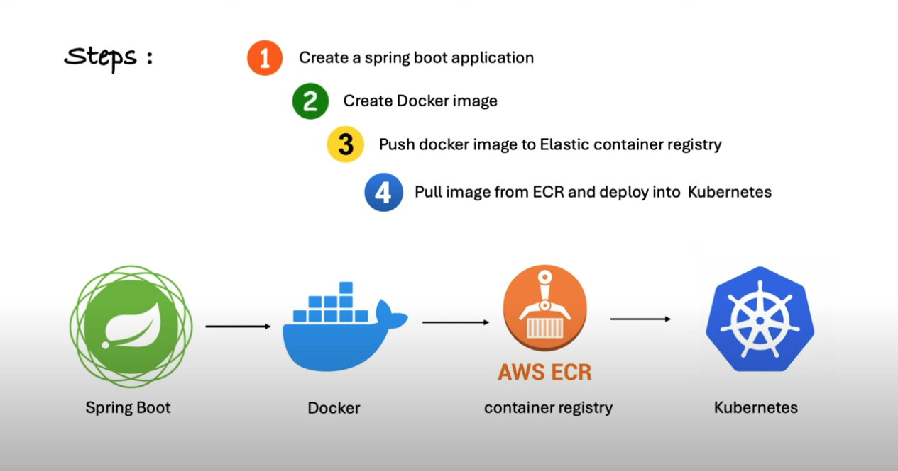
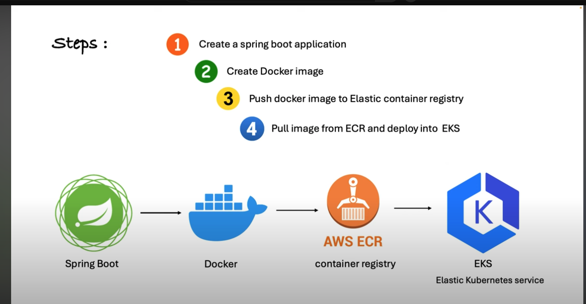
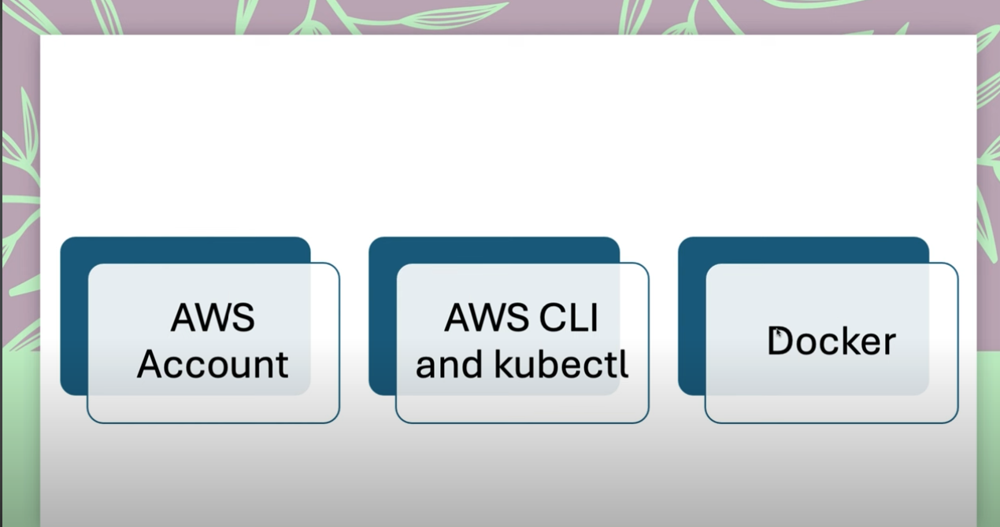
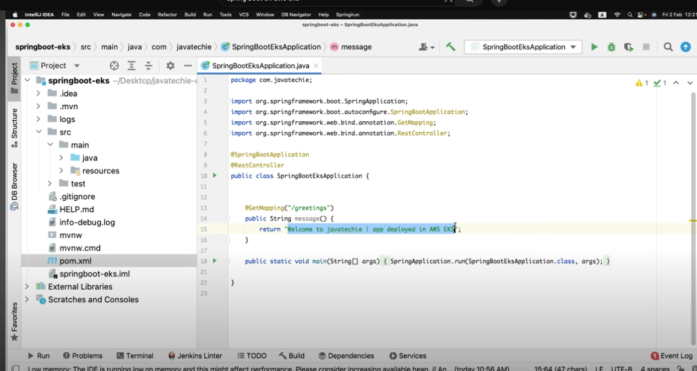
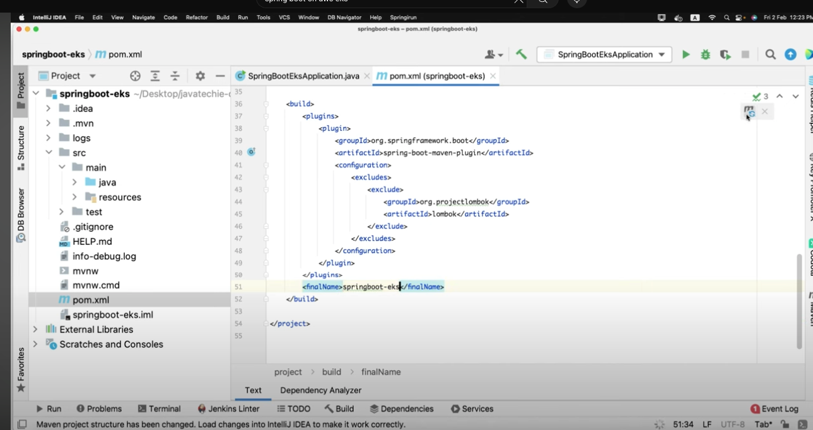

# Spring-Boot-on-EKS
https://www.youtube.com/watch?v=mVSFHgItaa4

pre-requisites:
* AWS Account
* AWS CLI
* KubeCTL
* Docker

Step 1: Create Spring Boot App

Spring Boot 3.2.0 - Dependencies

Spring Web
JDK 17
Lombok

Adding the final project name to spring boot
