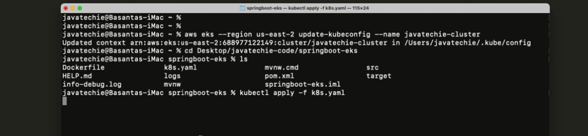

# Spring-Boot-on-EKS
https://www.youtube.com/watch?v=mVSFHgItaa4


pre-requisites:
* AWS Account
* AWS CLI
* KubeCTL
* Docker

Step 1: Create Spring Boot App


Spring Boot 3.2.0 - Dependencies

Spring Web
JDK 17
Lombok
mavenmkdir SpringBootOnEKS
cd SpringBootOnEKSmkdir SpringBootOnEKS
cd SpringBootOnEKS

Adding the final project name to spring boot

AWS ECR image URI
320233820907.dkr.ecr.us-east-1.amazonaws.com/springboot-eks:latest

AWS Account:
subbarao.cloud2023@gmail.com


step 4: create eks cluster in aws


command to create the aws cluster using kubectl
note: to create the cluser on aws; it takes 12-15 mints
```
eksctl create cluster --name jt-cluster --version 1.28 --nodes=1 --node-type=t2.small --region us-east-1
```
updated in local succesfull

update the cluster configuration
```
aws eks --region us-east-1 update-kubeconfig --name jt-cluster
```
Screenhot to view after updating the cluster configuration

after updating the configuration, we need to depploy app on eks;
for this, we need to define two files
1. deployment.yaml 
2. service.yaml
in the current video, both information is placed in k8s.yaml file
please find the screenshot with k8s.yaml containing both deployment and service

Updating the url for the image from ECR


Reference Git Repo from Java Tech
https://github.com/Java-Techie-jt/springboot-eks

applying the k8s.yaml using ekskube ctl command

kubectl apply -f k8s.yaml

app deployed successfully


to check the no of pods created for service
```
kubectl get svc
kubectl get pods
```


@bvsraov-glitch ➜ /workspaces/Spring-Boot-on-EKS/SpringBootOnEKS (main) $ kubectl get svc
NAME            TYPE           CLUSTER-IP      EXTERNAL-IP                                                               PORT(S)        AGE
kubernetes      ClusterIP      10.100.0.1      <none>                                                                    443/TCP        16m
myapp-service   LoadBalancer   10.100.19.137   a9307774becce418ca12c5652b7cca6a-1931012781.us-east-1.elb.amazonaws.com   80:31041/TCP 

delete the cluster - generic command
```
kubectl delete cluster jt-cluster
```
delete the cluster - aws eks command
```
eksctl delete cluster jt-cluster
```

